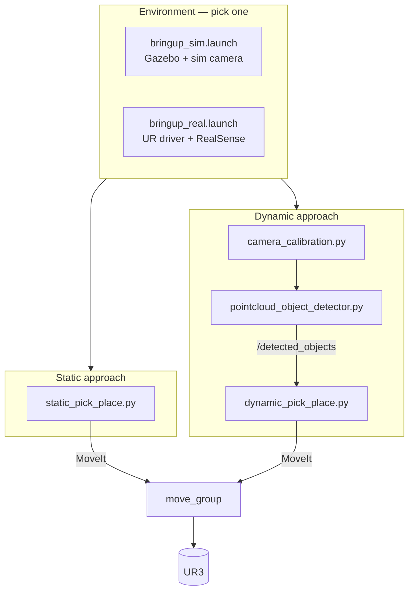

# UR3 Robotic Arm — Pick and Place

ROS Melodic project for a Universal Robots UR3 arm: a fixed-pose baseline and a camera-guided approach that segments a live depth point cloud, classifies what it sees, and sorts it into a box. Both run identically against Gazebo or the real arm.

📄 **[Full documentation, architecture, and demo video →](https://gab-es21.github.io/ur3-robotic-arm-pick-place/)**

## Four ways to run it

Two independent choices — **approach** (how the target pose is decided) and **environment** (what's actually moving the arm) — combine into four launch commands. Environment only changes the bringup; the pick-place logic itself is identical either way and never talks to `bringup_sim`/`bringup_real` directly, only to MoveIt, the gripper action server, and fixed topic names.

| | Simulation | Real robot |
| --- | --- | --- |
| **Static** | `roslaunch ur3_pick_place static/sim.launch` | `roslaunch ur3_pick_place static/real.launch` |
| **Dynamic** | `roslaunch ur3_pick_place dynamic/sim.launch` † | `roslaunch ur3_pick_place dynamic/real.launch` † |

† run `dynamic/calibrate.launch` once per camera mount first.

**Static** — `scripts/static/static_pick_place.py`

No perception: the object's location is fixed and known ahead of time. Home → approach → grasp → lift → move to drop pose → release → retreat, driven entirely through MoveIt. This is the baseline behind everything else — it validates the driver, controller, and planning pipeline before perception is layered on.

**Dynamic** — `scripts/dynamic/{camera_calibration,pointcloud_object_detector,dynamic_pick_place}.py`

An overhead depth camera drives a three-stage pipeline:

1. **Calibrate** — an ArUco board (marker id 582) held by the gripper is moved through a handful of known poses to solve the camera → robot base transform.
2. **Detect** — the workspace point cloud is cropped, the table plane is removed with RANSAC, the remaining points are clustered per object, and each cluster is classified as a **pen** or **cutlery** item by its bounding-box shape.
3. **Sort** — each detected object is picked up and dropped into a sorting box.



## Environments

| Aspect | Simulation | Real robot |
| --- | --- | --- |
| Bringup | `launch/common/bringup_sim.launch` | `launch/common/bringup_real.launch` |
| Arm | Gazebo + `ur_gazebo` | `Universal_Robots_ROS_Driver` |
| Camera | `urdf/depth_camera.urdf.xacro` (Gazebo depth plugin) | RealSense (`realsense2_camera`), relayed onto the same topic names |
| Env vars | `env/sim.env.sh` | `env/real.env.sh` |

### Environment variables

Sourced before `roslaunch`, read by the launch files via `$(optenv ...)` so nothing is hardcoded per-machine:

| Variable | Meaning | Set in |
| --- | --- | --- |
| `ROS_MASTER_URI`, `ROS_IP` | Standard ROS networking | both |
| `UR3_ROBOT_IP` | UR3 controller IP | `real.env.sh` |
| `UR3_KINEMATICS_CONFIG` | Per-robot calibration file from `ur_calibration` | `real.env.sh` |
| `UR3_USE_SIM` | Informational flag read by scripts that log their mode | both |

```bash
source env/real.env.sh && roslaunch ur3_pick_place static/real.launch
```

## Repository structure

```text
catkin_ws/src/ur3_pick_place/
├── package.xml / CMakeLists.txt / setup.py
├── msg/DetectedObject.msg          # class, pose, size, confidence
├── urdf/depth_camera.urdf.xacro    # overhead depth camera for Gazebo
├── src/ur3_pick_place/
│   └── gripper_interface.py        # shared GripperCommand wrapper
├── env/
│   ├── sim.env.sh
│   └── real.env.sh
├── config/
│   ├── static/poses.yaml           # fixed pick/place poses
│   └── dynamic/
│       ├── sorting_box.yaml
│       ├── object_classes.yaml     # pen/cutlery shape thresholds
│       ├── aruco_markers.yaml      # calibration board
│       └── camera_extrinsics.yaml  # last solved camera pose
├── launch/
│   ├── common/                     # bringup_sim, bringup_real, moveit_planning, spawn_camera
│   ├── static/{sim,real}.launch
│   └── dynamic/{calibrate,sim,real}.launch
└── scripts/
    ├── static/static_pick_place.py
    └── dynamic/{camera_calibration,pointcloud_object_detector,dynamic_pick_place}.py
```

## Setup (Ubuntu 18.04 + ROS Melodic)

```bash
sudo apt install ros-melodic-desktop-full ros-melodic-moveit ros-melodic-rqt* \
                  ros-melodic-aruco-ros ros-melodic-realsense2-camera
sudo rosdep init && rosdep update

mkdir -p catkin_ws/src && cd catkin_ws
git clone https://github.com/UniversalRobots/Universal_Robots_ROS_Driver.git src/Universal_Robots_ROS_Driver
git clone -b calibration_devel https://github.com/fmauch/universal_robot.git src/fmauch_universal_robot
# this repo's package:
#   copy catkin_ws/src/ur3_pick_place into src/

rosdep install --from-path src --ignore-src -y
catkin_make
source devel/setup.bash
```

## Running

### Simulation + Static

```bash
source env/sim.env.sh
roslaunch ur3_pick_place static/sim.launch
```

### Simulation + Dynamic

```bash
source env/sim.env.sh
roslaunch ur3_pick_place dynamic/calibrate.launch   # once per camera mount
roslaunch ur3_pick_place dynamic/sim.launch
```

### Real robot + Static

```bash
roslaunch ur_calibration calibration_correction.launch \
  robot_ip:=$UR3_ROBOT_IP target_filename:="$UR3_KINEMATICS_CONFIG"   # once per unit

source env/real.env.sh
roslaunch ur3_pick_place static/real.launch
```

### Real robot + Dynamic

```bash
roslaunch ur_calibration calibration_correction.launch \
  robot_ip:=$UR3_ROBOT_IP target_filename:="$UR3_KINEMATICS_CONFIG"   # once per unit

source env/real.env.sh
roslaunch ur3_pick_place dynamic/calibrate.launch   # once per camera mount
roslaunch ur3_pick_place dynamic/real.launch
```

## History

UR3 work at the socialab lab, 2020:

| Date | Milestone |
| --- | --- |
| Feb 17 | ROS Melodic + `Universal_Robots_ROS_Driver` installed |
| Feb 27 | UR3 Academy training modules, first driver bring-up |
| Mar 5 | First live joint control via `rqt_joint_trajectory_controller` |
| Mar 10–12 | MoveIt + RViz planning integration, controller topic testing |
| Aug 18 | ArUco marker targets prepared for camera calibration |
| Dec 9 | Arm recorded running — see [`docs/media/demo.mp4`](docs/media/demo.mp4) |
